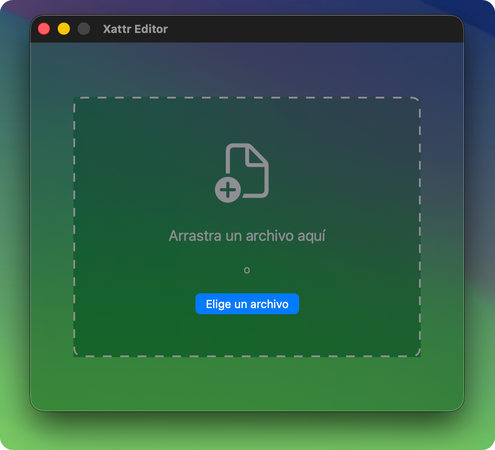
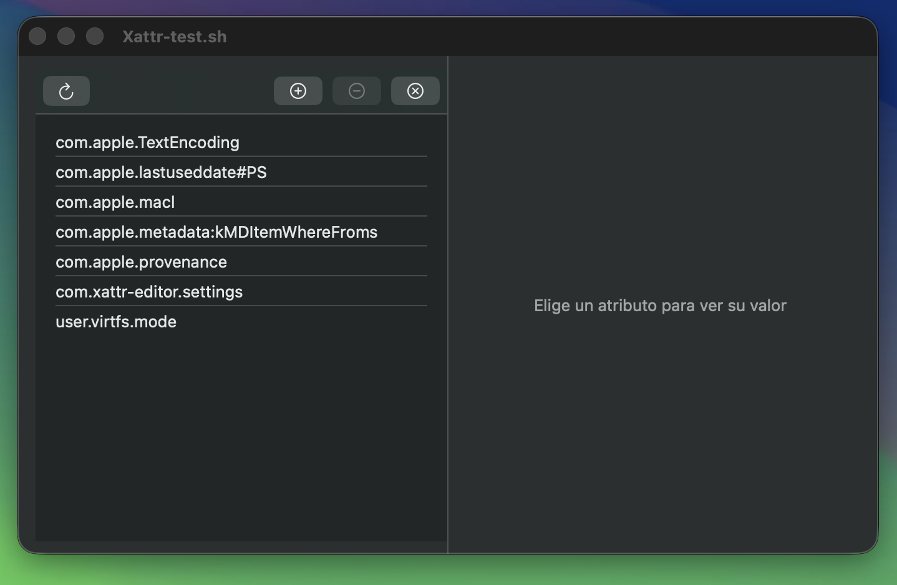
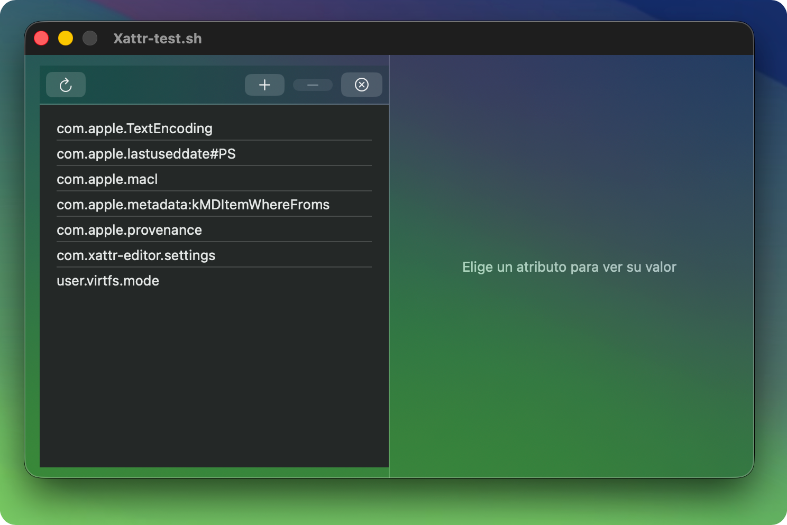

# Xattr Editor

## Versión SwiftUI

Este proyecto ha sido migrado desde XIB storyboard a SwiftUI, adoptando el marco de trabajo moderno para interfaces de usuario en macOS, con soporte para efecto Liquid Glass en macOS 15+. 

La app ahora requiere:

- **Xcode 15** o superior
- **macOS 14.0** o superior
- **Swift 5.9**

## Introducción

Xattr Editor es una sencilla aplicación GUI para ver y editar atributos extendidos de archivos en macOS, ideal para usuarios que prefieren una interfaz gráfica (arrastrar y soltar un archivo y ver sus atributos extendidos) en lugar de abrir la Terminal e interactuar con `xattr`. Con la ventaja adicional de que los atributos se pueden editar uno por uno, añadiendo, modificando o eliminando cualquiera de ellos.

La desventaja de Xattr Editor es que, al ser una aplicación descargada de internet, también muestra la advertencia de Gatekeeper al ejecutarse por primera vez. Esto es inevitable, ya que la aplicación solo está firmada ad hoc y no está notarizada. Esto no ocurre si se descarga el código fuente, se compila la aplicación con Xcode y se usa el producto ejecutable para su uso habitual.

Este [documento](DOCS/App-damaged-ES.md) amplía la información sobre la advertencia de seguridad en archivos descargados de Internet y ofrece tres maneras de solucionarla: Seguridad y Privacidad, la herramienta de línea de comandos `xattr` y el **Xattr Editor**.

## Cómo usar Xattr Editor

Es muy fácil de usar. Al iniciar la aplicación, aparece una ventana donde puedes arrastrar y soltar archivos.

| Ventana Arrastrar y Soltar | 
|:----|
|  |
|  |

También puedes usar el menú Archivo >> Abrir (Cmd + O), que te permite seleccionar un archivo en lugar de arrastrarlo a la ventana. En ambos casos, se abre la ventana principal con los atributos extendidos (si los hay) y sus propiedades.

| Ventana Atributos | 
|:----|
|  |
|  |

**Nota**: primera imagen en Sonoma (sin Liquid Glass), segunda en Tahoe (soporte para Liquid Glass).

Puedes agregar, renombrar, eliminar o modificar las propiedades de los atributos existentes.

Al eliminar un atributo, el usuario recibe una notificación. 

### Compatibilidad con Liquid Glass

La app es compatible con el efecto Liquid Glass (material translúcido) para macOS 15 (Sequoia) y versiones posteriores, incluyendo macOS 26 (Tahoe), manteniendo al mismo tiempo la retrocompatibilidad total con macOS 14.

## Créditos

*rcsiko* es el autor del repositorio original [xattr-editor](https://github.com/rcsiko/xattr-editor), que no se ha actualizado en 7 años. He creado mi propio repositorio basado en el original, que contiene la parte más importante del código fuente.

Registro de cambios realizados en mi repositorio:

- Añadir icono de la aplicación en Assets.xcassets
- Corregir las advertencias de `swiftlint` y refactorizar el código Swift
- Añadir aviso al usuario (alerta) en la eliminación de atributos
- Corregir la advertencia de error al renombrar atributos
- Borrar el campo de valor del atributo al eliminar atributos
- Volver a mostrar la ventana de soltar archivo al cerrar el inspector de atributos
- Mejorar el archivo README y la documentación
- Actualizar las capturas de pantalla
- Añadir el idioma español
- Migrar el proyecto de storyboard a SwiftUI
- Añadir soporte para Liquid Glass en macOS 15+ manteniendo compatibilidad hacia atrás con macOS 14.
