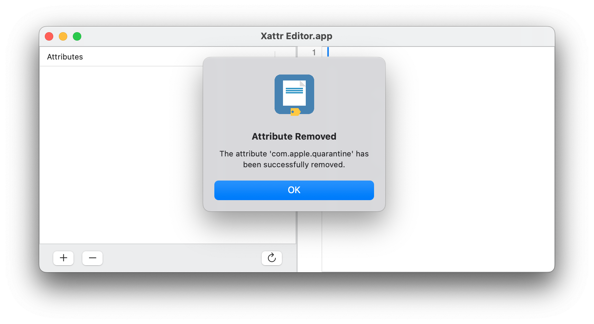

# Xattr Editor

Xattr Editor es una sencilla aplicación GUI para ver y editar atributos extendidos de archivos en macOS, ideal para usuarios que prefieren una interfaz gráfica (arrastrar y soltar un archivo y ver sus atributos extendidos) en lugar de abrir la Terminal e interactuar con `xattr`. Con la ventaja adicional de que los atributos se pueden editar uno por uno, añadiendo, modificando o eliminando cualquiera de ellos.

La desventaja de Xattr Editor es que, al ser una aplicación descargada de internet, también muestra la advertencia de Gatekeeper al ejecutarse por primera vez. Esto es inevitable, ya que la aplicación solo está firmada ad hoc y no está notarizada. Esto no ocurre si se descarga el código fuente, se compila la aplicación con Xcode y se usa el producto ejecutable para su uso habitual.

Este [documento](DOCS/App-damaged-ES.md) amplía la información sobre la advertencia de seguridad en archivos descargados de Internet y ofrece tres maneras de solucionarla: Seguridad y Privacidad, la herramienta de línea de comandos `xattr` y el **Xattr Editor**.

## Cómo usar Xattr Editor

Es muy fácil de usar. Al iniciar la aplicación, aparece una ventana donde puedes arrastrar y soltar archivos.

También puedes usar el menú Archivo >> Abrir (Cmd + O), que te permite seleccionar un archivo en lugar de arrastrarlo a la ventana. En ambos casos, se abre la ventana principal con los atributos extendidos (si los hay) y sus propiedades.

Puedes agregar, renombrar, eliminar o modificar las propiedades de los atributos existentes.

Al eliminar un atributo, el usuario recibe una notificación. Por ejemplo, eliminar el atributo `com.apple.quarantine`:

