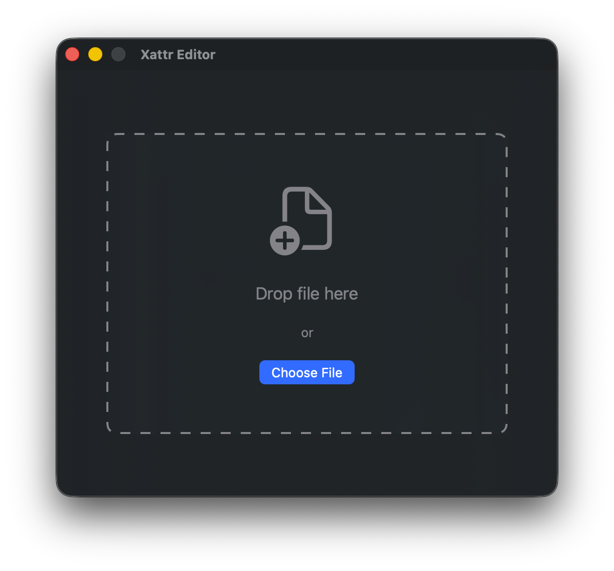
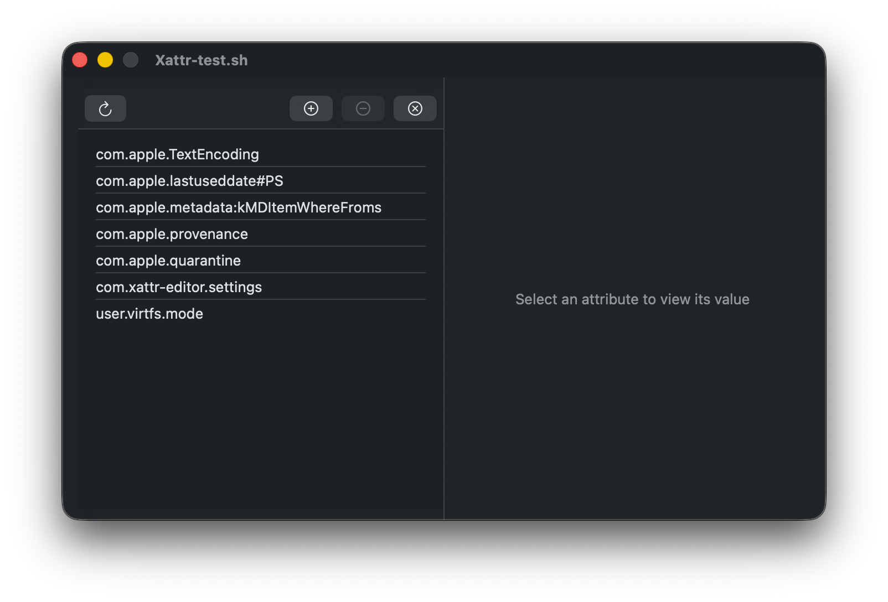

# Xattr Editor

  

This project is an expansion of [Xattr-remove](https://github.com/perez987/Xattr-remove). These are the differences between the two projects:

- **Xattr-remove**
   - Simple and lightweight
   - Focused on a single task (removing `com.apple.quarantine` from files downloaded from the internet)
   - Minimal user intervention (the app closes automatically 3 seconds after successfully completing the task)
- **Xattr Editor**
   - More complex, although the final size of both applications differs by only 0.5 MB
   - Extended attribute editing functions (view, modify, remove, or add attributes)

## Credits

*rcsiko* is the author of the original repository [xattr-editor](https://github.com/rcsiko/xattr-editor), which hasn't been updated in 7 years. I've created this fork based on the original, which contains the most important part of the source code.  

Changelog oy my additions:

- Add app icon in Assets.xcassets
- Fix `swiftlint` warnings and refactor Swift code
- Migrate storyboard project to SwiftUI
- Add user feedback (alert) for attribute removal
- Fix error warning in attribute renaming
- Clear the attribute value field when deleting attributes
- Re-show drop file window when closing attribute inspector
- Improve README and documentation
- Update screenshots
- Add language support: German, English, Spanish, French and Italian  (default to English)
- Added language selector
- Add soft Liquid Glass support.

## SwiftUI Version

Original repo is based on XIB storyboard but it has been migrated to SwiftUI, providing a modern UI framework with Liquid Glass effect support for macOS 15+. The app requires:

- **Xcode 15** or later
- **macOS 14.0** or later
- **Swift 5.9**

## Preface

Xattr Editor is a simple GUI application to view/edit extended file attributes on macOS, for those users who might find a graphical interface more convenient—where they can drag and drop a file and view its extended attributes—rather than opening Terminal and interacting with `xattr`. With the added advantage that attributes can be edited one by one, adding, modifying, or deleting any of them.

The drawback of Xattr Editor is that, as an application downloaded from the internet, it also displays the Gatekeeper warning on its first run. This is unavoidable since the app is only ad-hoc signed and not notarized. This doesn't happen if you download the source code, compile the app using Xcode, and save the product for regular use.

This [document](DOCS/App-damaged.md) expands on the information about the security warning in files downloaded from the Internet, and 3 ways to fix it: Security and Privacy, `xattr` command line tool and **Xattr Editor**.
 
## Xattr Editor how-to 

It's really simple to use. When you start the app, a window appears where you can drag and drop files.

| Drop file window | 
|:----|
|  |

You can also use the File >> Open menu (Cmd + O), which allows you to select a file instead of dragging it onto the window. Either way, the main window opens with the extended attribute(s) (if any) and their properties.

| Attributes window | 
|:----|
|  |

You can add, rename, delete, or modify properties of existing attributes.

When removing an attribute, the user receives feedback.

### Language selector

| Languages list | 
|:----|
|  |
